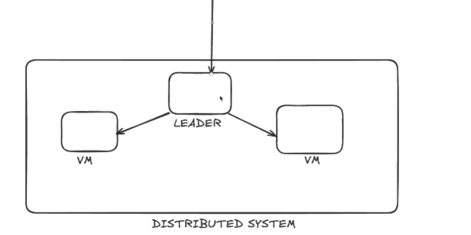

## Architecture
Redshift is a dsitributed system with 3core components:
* Leader Node: The leader node is the part of Redshift that receives and parses query from clients.
* Compute nodes: These query received by leader node/master node is distributed among the compute nodes.
* Node slices: A slice of a node is typically the components of the node, namely: 
    * compute/CPU
    * memory/RAM
    * storage/disk





## Distribution styles
This is the mode of distribution of data among compute nodes to optimize query performance and limit overral data movement.

### Types
* `Auto`: This is the default mode of distribution. Redshift(master node) assigns data to each compute nodes of a cluster based what it assumes to be best fit.

* `Key`: In `key` distribution style, data (table) is distributed across compute nodes on a specific column/field. The rows corresponding to a value/category in this column are stored in the same place. An ideal use case is big data, data with frequent joins.

* `Even`: This distribution style allows data to be distributed following round-robin fashion. It is suitable for data join operations would not be frequently performed.

* `All`: This style makes a copy of table in all compute nodes. It is best used for tables that are not regularly updated and also small in size such the product codes and names tables.

## Sort Keys
This is the approach taken by redshift to sort/order data in the computation slices.
### Types
* Compund
* Interleaved
* Auto

* `COMPOUND`: This type of sorting gives a form of hierarchy to the list of columns defined, with the most prioritized being the first column/field.

The example below creates a table and used the `COMPOUND SORTKEY` approach, hence, the physical data stored in this node will be ordered by the `order_date` column.

```SQL
CREATE TABLE my_table (
    order_id INT
    order_date DATE
    no_of_items INT
    item_id INT
    customer_id INT
)
DISTKEY (order_date)
COMPOUND SORTKEY (order_date, item_id, customer_id);
```

* `INTERLEAVED`: In this type of sorting, all columns defined in the `sortkey` are prioritized similarly, no form of hierarchy exists, leading to faster queries.

* `AUTO`: This is the recommended type of sorting as it allows Redshift to take the more optimized approach between `COMPOUND` and `INTERLEAVED`. It is also important to note that if no `SORTKEY` is defined, `COMPOUND` is appleid by default.

## The `COPY` command
This is the most efficient way to populate the Amazon data warehouse with data from data files/tables. It uses the `Masively Pararllel Processing (MPP)`. For instance: laod from Amzaon s3 to Amazon Redshift.

## The `UNLOAD` command
This is a way of writing files from redshift to destination, for example: Amazon s3.
Points to note when unloading from redshift:
* The number of files that will be written to s3 will be determined by the number of compute nodes in a cluster. That is, if there are 5 nodes in a cluster, five different files will be created in s3 consisting of data from each compute node.
* To write files from all compute into a single file, turning off the paralllel option `parallel off` is required.
